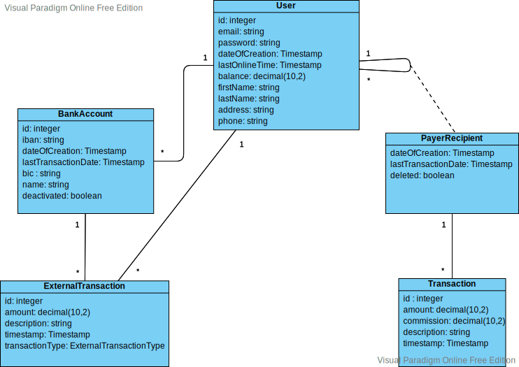
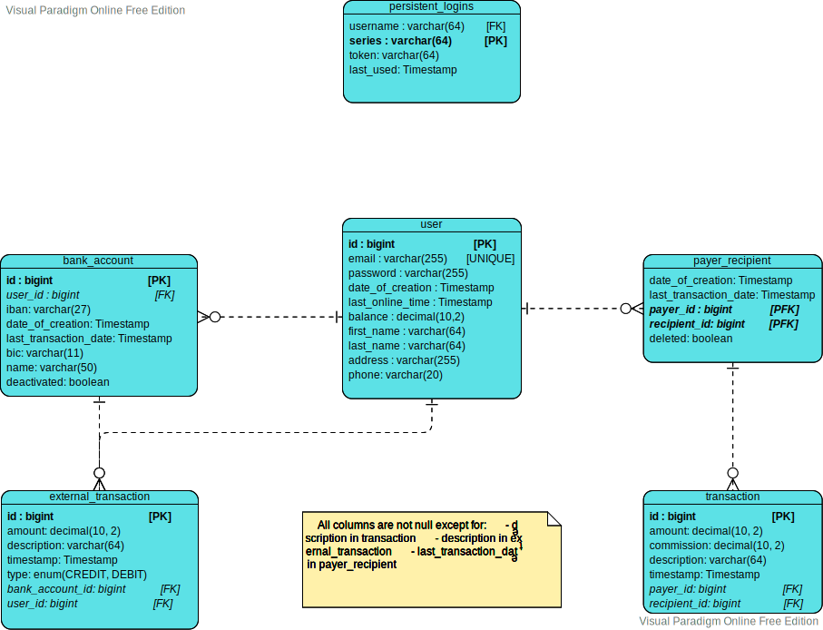

## PayMyBuddy

PayMyBuddy is a Spring Boot application made with Maven.

It enables registered users to find each other via an email address and to exchange money between each other. 

To run the application, execute commands

`mvn install`

and 

`mvn spring-boot:run`

### UML Diagram

### Entity Relationship Diagram

### SQL scripts

The database can be created (schema and data) from within mysql with the command :
`mysql> source paymybuddy_dump.sql`
The dump file 'paymybuddy_dump.sql' is located at the root of the repository.

### Testing and coverage

To run the tests from maven, go to the folder that contains the pom.xml file and execute the below command.

`mvn test`

To get the coverage report from Jacoco, run command

`mvn verify`

The HTML report index.html can be found in the folder jacoco in target/site. Models, DTOs, DataSource and 
SafetyNetApplication are excluded from the coverage.

The Surefire reports can be found in the surefire-reports folder in target/.